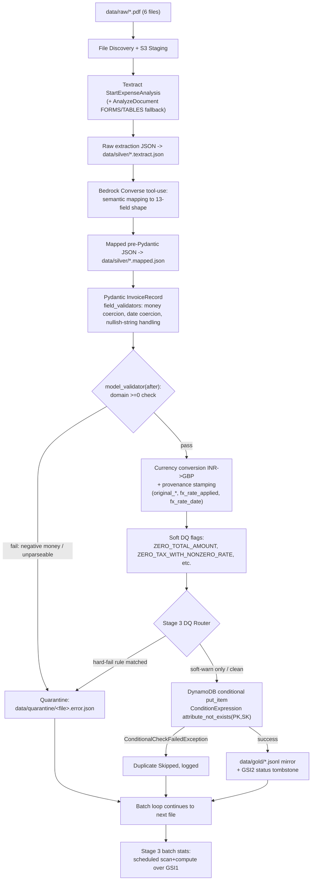

# Invoice Pipeline — Architecture & Blueprint

**Status:** MVP design spec
**Scope:** Extraction, semantic mapping, validation, data quality, and storage for a daily-batch, multi-vendor PDF invoice pipeline. Upstream S3 ingestion is out of scope (assumed functional).

---

## 0. Preface — Discrepancies & Starting State

Two numbers in the original brief don't match reality, and are documented here rather than silently reconciled:

- **Sample count**: the brief references "10 sample PDF invoices." `data/raw/` currently contains **6**. The design below is validated against all 6 real files; it must be re-validated against the remaining 4 once they land, since vendor variance is the whole point of this project and 4 unseen samples could surface new failure modes.
- **Field count**: the brief calls the canonical schema "10 specific target fields." The field list actually supplied enumerates **13** distinct fields (`Date`, `Company Name`, `Buyer Name`, `Invoice/Reference Number`, `Product Name(s)`, `Product Amount`, `Total Amount`, `VAT/Tax`, `VAT/Tax Percentage`, `VAT/Tax Amount`, `Coupon/Discount Amount`, `Mode of Payment`, `Currency`), plus `Address` explicitly called out as a 14th, **unmapped** field. This document designs for 13 canonical fields + 1 unmapped field.

**Existing repo state**: `data/raw/`, `data/silver/`, `data/gold/` already exist (medallion-style layering), alongside an empty `docs/`. No `src/`, no dependency manifest yet. This design extends the existing `raw → silver → gold` convention rather than proposing a competing layout.

### What the 6 real samples actually contain

Direct inspection (a stdlib-only PDF text-stream parser, since no PDF libraries were yet installed in the project's venv) surfaced concrete failure modes that drove every decision below — not hypothetical edge cases:

| # | File | Text layer | Failure mode |
|---|---|---|---|
| 1 | `2324GBRAMD125920.pdf` (VFS Global visa tax invoice) | Present, **corrupted** | Custom-font glyph mapping — buyer name decodes to garbage bytes; digits are kerning-split (`1 1 1,333.00`); internal contradiction: `Grand Total: 0.00` vs. `Amount: 1,333.00` on the same document |
| 2 | `7042968270_543523577_4_2026.pdf` (Airtel postpaid statement, 6pp) | Present, **scrambled reading order** | Column text interleaves irregularly across the text stream; 4+ competing "total" figures (last bill, this month's charges, amount payable, amount after due date) and multiple dates (statement date, due date, period start/end) — genuine semantic ambiguity, not an OCR problem |
| 3 | `E-Receipt (2).pdf` | **None** | Image-only / scanned |
| 4 | `Invoice1653194348.pdf` (Gym Lounge membership) | Present, clean | Literal string `GST NO : null` (vendor's own system emitted the word "null"); invoice number `Gym Lounge//2022-2023/240` re-spaces inconsistently within the same document; SGST/CGST both `0.00` despite a 9% rate label |
| 5 | `Order_ID_7104598035.pdf` | **None** | Image-only / scanned |
| 6 | `SALES RECEIPT_304743_1750688634308.pdf` | **None** | Image-only / scanned |

Half the samples have no text layer at all, and one of the remaining three is actively misleading. **Any design that treats the PDF's embedded text as ground truth is dead on arrival for the majority of real inputs.** All 6 samples are INR-denominated, making INR→GBP conversion the primary path through the pipeline, not an edge case.

---

## 1. Stage 1 — Extraction & Parsing: Trade-Off Analysis

### The framing correction

AWS Textract's `AnalyzeExpense` / `AnalyzeDocument` APIs OCR the **rendered page raster**, not the PDF's embedded text stream. This means Textract is structurally immune to both the corrupted-cmap failure (sample 1) and the scrambled-reading-order failure (sample 2) — it never touches the broken text stream in the first place — and it handles the three image-only samples (3, 5, 6) exactly the same way it handles the rest. There is no "use the text layer when present, fall back to OCR otherwise" shortcut worth building: Textract should run uniformly on every document.

### Trade-off table

Pricing below is approximate current AWS public list pricing (US regions, on-demand tier) — re-verify against the live pricing calculator before committing to a budget line, since tiered discounts and regional variance apply.

| Dimension | Textract-only | Bedrock-vision-only | **Hybrid (recommended)** |
|---|---|---|---|
| Cost / 1-page doc | ~$0.01 (`AnalyzeExpense`) | ~$0.006–0.04 (Haiku/Sonnet vision, ~1,200–5,000 image tokens/page + prompt) | ~$0.01 Textract + ~$0.003 Haiku text-only ≈ **$0.013** |
| Cost / 6-page doc (Airtel-scale) | ~$0.06 | ~$0.04–0.24 | ~$0.06 + ~$0.005 ≈ **$0.065** |
| Latency | 1–2s sync / 3–8s async | 2–5s per page, doesn't parallelize as cheaply | ~3–6s (two sequential calls; the Bedrock leg is cheap since its input is small JSON, not an image) |
| Digit/OCR reliability | High — purpose-built OCR/geometric ML | Weaker — vision LLMs are known to transpose/merge digits in dense numeric tables | High — inherits Textract's OCR grade |
| Tabular line items | Good via `LineItemGroups` / Tables geometry | Inconsistent without bbox grounding | Good — Textract geometry + Bedrock reconciles vendor-arbitrary line labels |
| Sample 1 (corrupted cmap) | Unaffected (raster-based) | Unaffected (raster-based) | Unaffected |
| Sample 2 (scrambled order, 4+ totals) | Extraction unaffected (Textract's KV pairing is spatial, not text-stream order), but **cannot decide which total is canonical** | Can reason about which total is canonical, at higher cost / lower digit fidelity | Textract solves extraction-order; Bedrock solves "which total is canonical" |
| Samples 3/5/6 (image-only) | Native fit | Native fit | Native fit — no differentiator here |
| Sample 4 (`null` literal, 0.00 tax at 9%) | Extracts faithfully; no concept of "this is an anomaly" | Could flag it, at OCR-cost/reliability disadvantage | Textract extracts faithfully; Bedrock/Pydantic layer flags the anomaly (Stage 2/3) |
| Vendor vocabulary → fixed ontology mapping | **Cannot do this** — returns raw labels as-is | Can do this | **This is the entire reason for the hybrid split** |

### Recommendation

**Hybrid: Textract for all spatial OCR/extraction, Bedrock (text-only) for semantic mapping.** Textract is immune to the two failure modes that defeat naive text extraction and is cheaper/more reliable at OCR than a vision LLM; Bedrock is the only component capable of resolving genuine semantic ambiguity — which of N "total"-labeled fields is canonical, and how arbitrary vendor vocabulary maps onto a fixed 13-field ontology. Running Bedrock in vision mode would pay full image-token cost to redo work Textract already does better.

### Call sequence

```
1. Stage PDF to S3: s3://<bucket>/incoming/<batch_id>/<filename>
   (required for Textract's async APIs — the 6-page Airtel doc exceeds
   the sync single-page limit)

2. Primary: textract.start_expense_analysis(S3Object=...)   [async]
   -> SummaryFields (label/value pairs, normalized Type enums like
      TOTAL, INVOICE_RECEIPT_DATE, VENDOR_NAME, each with Confidence)
   -> LineItemGroups (tabular line items)
   Poll via get_expense_analysis or an SNS completion topic.

3. Fallback (only if LineItemGroups is empty/low-confidence, or overall
   summary-field confidence is uniformly low):
   textract.start_document_analysis(FeatureTypes=["FORMS","TABLES"])
   on the same S3 object, to recover raw KV/table geometry the
   expense-specific parser missed.

4. Persist raw Textract output (native field names, values, Confidence
   scores, line-item rows) to data/silver/<filename>.textract.json
   -- NOT yet canonical-field-mapped. This enables replay/debugging
   without re-calling AWS.

5. bedrock-runtime.converse(...) with toolConfig forcing
   tool_choice={"tool": "map_invoice_fields"}, where the tool's
   inputSchema is a strict JSON Schema mirroring the 13 canonical
   fields + a source_label/source_confidence pass-through per field.
   Model default: Claude Haiku 4.5 (cost); escalate to Sonnet only on
   a validation retry. Input content is the Stage-4 raw JSON (text),
   not an image, plus a system prompt describing each canonical
   field's semantics and disambiguation rules, e.g.:
   "total_amount = the final amount payable after tax and discount;
   prefer 'Amount Payable'/'Grand Total'/'Total Due' over
   'Previous Balance'/'Last Bill Amount'."

6. Persist Bedrock's forced tool-call JSON to
   data/silver/<filename>.mapped.json, then hand to the Stage 2
   Pydantic model for typed coercion/validation.
```

---

## 2. Stage 2 — Semantic Mapping & Pydantic V2 Validation Layer

### Mapping mechanism

The Bedrock tool-use call (Stage 1, step 5) is the **primary and required** mapper. A static vendor-alias lookup table was rejected as the primary mechanism: VFS, Airtel, and Gym Lounge use mutually unrelated label vocabularies, and a fixed alias table degenerates into vendor-specific `if/else` in disguise, requiring maintenance for every new vendor.

An optional `vendor_alias_cache`, keyed by normalized `company_name`, is included purely as a **cost optimization**: once Bedrock has confidently mapped a given vendor's label set once, cache the label → canonical-field association and skip the LLM call on subsequent invoices from that vendor, falling back to Bedrock whenever the vendor is new or the cached mapping's confidence was below threshold. Bedrock remains the source of truth; the cache is a derived accelerator, never the primary logic path.

### Pydantic V2 model

```python
# src/validation/models.py
import re
from datetime import date as date_, datetime
from decimal import Decimal, InvalidOperation
from pydantic import BaseModel, Field, field_validator, model_validator, ConfigDict

_NULLISH = {"null", "none", "nan", "n/a", "na", ""}
_MONEY_FIELDS = (
    "product_amount", "total_amount", "vat_tax_amount", "coupon_discount_amount",
    "original_total_amount", "original_product_amount",
    "original_vat_tax_amount", "original_coupon_discount_amount",
)


class InvoiceRecord(BaseModel):
    model_config = ConfigDict(str_strip_whitespace=True, validate_assignment=True)

    # --- 13 canonical fields ---
    date: date_ = Field(...)
    company_name: str = Field(..., min_length=1)
    buyer_name: str = Field(..., min_length=1)
    invoice_reference_number: str = Field(..., min_length=1)
    product_name: str = Field(default="N/A")
    product_amount: Decimal = Field(default=Decimal("0"))
    total_amount: Decimal = Field(default=Decimal("0"))
    vat_tax_label: str = Field(default="N/A")
    vat_tax_percentage: str = Field(default="N/A")
    vat_tax_amount: Decimal = Field(default=Decimal("0"))
    coupon_discount_amount: Decimal = Field(default=Decimal("0"))
    mode_of_payment: str = Field(default="N/A")
    currency: str = Field(..., min_length=1)  # always "GBP" after normalization

    # --- provenance / audit (required by design, not part of the "13") ---
    original_currency: str
    original_total_amount: Decimal
    original_product_amount: Decimal
    original_vat_tax_amount: Decimal
    original_coupon_discount_amount: Decimal
    fx_rate_applied: Decimal
    fx_rate_date: date_
    source_file: str
    extraction_confidence: dict[str, float] = Field(default_factory=dict)
    dq_flags: list[str] = Field(default_factory=list)
    unmapped_metadata: dict[str, str] = Field(default_factory=dict)

    # ---- validator 1: money coercion (symbols, kerning-split digits, commas) ----
    @field_validator(*_MONEY_FIELDS, mode="before")
    @classmethod
    def _coerce_money(cls, v):
        if v is None or v == "":
            return Decimal("0")
        if isinstance(v, Decimal):
            return v
        s = str(v).strip()
        s = re.sub(r"[₹`£$]|(?i:Rs\.?|INR|GBP)", "", s)          # strip symbols/codes
        s = re.sub(r"(?<=\d)\s+(?=\d)", "", s)                    # "1 1 1,333.00" -> "111,333.00"
        s = s.replace(",", "").strip()
        if s.lower() in _NULLISH or s == "-":
            return Decimal("0")
        try:
            return Decimal(s)
        except InvalidOperation:
            raise ValueError(f"cannot coerce {v!r} to Decimal")

    # ---- validator 2: date coercion, multiple source formats -> target ----
    @field_validator("date", mode="before")
    @classmethod
    def _coerce_date(cls, v):
        if isinstance(v, date_):
            return v
        s = str(v).strip()
        for fmt in ("%d-%m-%Y", "%d/%m/%Y", "%Y-%m-%d", "%d %b %Y", "%d %B %Y", "%m/%d/%Y"):
            try:
                return datetime.strptime(s, fmt).date()
            except ValueError:
                continue
        raise ValueError(f"unrecognized date format: {v!r}")

    # ---- validator 3: literal "null"-string vendor bug (sample 4) ----
    @field_validator("vat_tax_label", "product_name", "mode_of_payment", mode="before")
    @classmethod
    def _normalize_nullish_optional_str(cls, v):
        s = "" if v is None else str(v).strip()
        return "N/A" if s.lower() in _NULLISH else s

    @field_validator("company_name", "buyer_name", "invoice_reference_number", "currency", mode="before")
    @classmethod
    def _reject_nullish_mandatory_str(cls, v):
        s = "" if v is None else str(v).strip()
        if s.lower() in _NULLISH:
            raise ValueError(f"mandatory field received nullish literal value {v!r}")
        return s

    # ---- model_validator(after): domain check -> FX conversion -> soft DQ flags ----
    @model_validator(mode="after")
    def _apply_domain_fx_and_dq(self) -> "InvoiceRecord":
        for f in ("product_amount", "total_amount", "vat_tax_amount", "coupon_discount_amount"):
            if getattr(self, f) < 0:
                raise ValueError(f"{f}={getattr(self, f)} violates >=0 domain constraint")

        if self.original_currency.upper() == "INR" and self.currency.upper() != "GBP":
            rate = self.fx_rate_applied
            for f in ("product_amount", "total_amount", "vat_tax_amount", "coupon_discount_amount"):
                setattr(self, f, (getattr(self, f) / rate).quantize(Decimal("0.01")))
            self.currency = "GBP"

        if self.total_amount == 0:
            self.dq_flags.append("ZERO_TOTAL_AMOUNT")
        if self.product_amount == 0:
            self.dq_flags.append("ZERO_PRODUCT_AMOUNT")
        if self.vat_tax_amount == 0 and self.vat_tax_percentage not in ("N/A", "0%"):
            self.dq_flags.append("ZERO_TAX_WITH_NONZERO_RATE")  # sample 4 case
        return self
```

### Design decisions, stated explicitly

- **Numeric fields are `Decimal`, never `float`** — avoids binary rounding on money. `product_amount`, `total_amount`, `vat_tax_amount`, `coupon_discount_amount` default to `Decimal("0")` when not extractable and are **never** `None` or the string `"N/A"` — 0 is a valid business value (confirmed against the VFS sample, where `Grand Total: 0.00` is legitimate). `"N/A"` remains valid only on the `str`-typed fields (`product_name`, `mode_of_payment`, `vat_tax_label`).
- **Domain assertion is `>= 0`, not `> 0`** — hard-fails only on negative values. `total_amount == 0` sets a soft `ZERO_TOTAL_AMOUNT` warning flag but still loads to storage, resolving the VFS sample's internal `0.00`-vs-`1,333.00` conflict without discarding the file.
- **Currency conversion timing**: runs inside `model_validator(mode="after")`, *after* the domain `>=0` check (fail fast before doing FX math on invalid data) and *after* per-field type coercion (FX math needs typed `Decimal`, not raw strings), but *before* soft DQ flagging (so `ZERO_TOTAL_AMOUNT` etc. reflect the final, post-conversion, actually-stored value).
- **Original-value preservation**: the mapping layer populates `original_total_amount` / `original_product_amount` / etc. with the same raw INR value it also assigns to the canonical fields, both passing through the identical `_coerce_money` validator. Only the model-validator mutates the *canonical* fields afterward — `original_*` fields are never touched post-construction, giving a fully reversible audit trail (`original_amount / fx_rate_applied ≈ converted_amount`).
- **`currency` always ends up `"GBP"`** after normalization; `original_currency` preserves the source. Downstream consumers need one consistent reporting unit to sum/compare across vendors without re-deriving FX math per query; the `original_*` fields keep the transform fully inspectable.
- **`fx_rate_applied` / `fx_rate_date`** are not hardcoded in the model — loaded once per pipeline run from `config/fx_rates.yaml` (e.g. `{"INR_GBP": 125}` — 1 GBP = 125 INR, MVP fixed rate, config-overridable) and injected by ingestion glue at model-construction time.
- **`extraction_confidence` population**: Bedrock's tool-use output includes, per mapped canonical field, the `source_label` it mapped from (the original Textract field name); ingestion glue cross-references that label back into Textract's own `Confidence` score from the Stage 1 raw JSON.
- **Product Name(s) tension**: the spec types this field as a flat `str`, but real invoices (Gym Lounge, Airtel) have genuine multi-row line-item tables. Resolution: canonical `product_name` stays a flat, semicolon-joined string (e.g. `"Gym Membership Fee; Registration Fee"`) — satisfying the `str` constraint — while the full structured line items (from Textract's `LineItemGroups`/Tables geometry) are additionally preserved, lossless, as JSON under `unmapped_metadata["line_items"]`.
- **`Address` is never a top-level field** — the Bedrock mapping tool schema has no top-level slot for it; it is always routed into `unmapped_metadata["address"]`.

---

## 3. Stage 3 — Data Quality, Schema Assertions & Exception Routing

### Declarative rule set

```yaml
hard_fail_rules:            # -> quarantine, never reach storage
  - name: MISSING_MANDATORY_FIELD
    condition: "date | company_name | buyer_name | invoice_reference_number | currency is empty/nullish"
    stage: pydantic_validation
  - name: NEGATIVE_MONEY_VALUE
    condition: "any money field < 0"
    stage: pydantic_validation
  - name: UNPARSEABLE_DATE
    condition: "date string matches none of the known formats"
    stage: pydantic_validation
  - name: UNPARSEABLE_DECIMAL
    condition: "money string cannot coerce to Decimal after cleaning"
    stage: pydantic_validation
  - name: EXTRACTION_FAILED
    condition: "Textract job failed / Bedrock tool-use call errored or returned invalid schema after 1 retry"
    stage: extraction_or_mapping

soft_warn_rules:            # -> load to storage with dq_flags, no quarantine
  - name: ZERO_TOTAL_AMOUNT
    condition: "total_amount == 0"
    example: "2324GBRAMD125920.pdf (VFS Grand Total legitimately 0.00)"
  - name: ZERO_PRODUCT_AMOUNT
    condition: "product_amount == 0"
  - name: ZERO_TAX_WITH_NONZERO_RATE
    condition: "vat_tax_amount == 0 and vat_tax_percentage not in ('N/A', '0%')"
    example: "Invoice1653194348.pdf (SGST/CGST 9% but amount 0.00)"
  - name: LOW_FIELD_CONFIDENCE
    condition: "any successfully-typed field's Textract confidence < 60"
  - name: AMBIGUOUS_DATE_FORMAT
    condition: "numeric date where day and month are both <=12 (dd/mm vs mm/dd ambiguous)"
  - name: MULTIPLE_TOTAL_CANDIDATES
    condition: "Bedrock mapping selected among >=2 plausible 'total'-labeled source fields"
    example: "7042968270_543523577_4_2026.pdf (4+ competing totals)"

special_routing:
  - name: DUPLICATE_SKIPPED
    condition: "storage conditional write fails because the natural key already exists"
    action: "log + record as duplicate outcome; NOT quarantine (record is valid, just already loaded)"
```

### Quarantine mechanism

The raw PDF is **never moved** — `data/raw/` stays immutable. On any hard-fail, the orchestrator writes a sidecar to `data/quarantine/<filename>.error.json`:

```json
{
  "source_file": "data/raw/2324GBRAMD125920.pdf",
  "failed_at_stage": "pydantic_validation",
  "failed_at_utc": "2026-09-09T12:00:00Z",
  "error_type": "ValidationError",
  "error_detail": [
    {"loc": ["total_amount"], "msg": "...", "type": "value_error", "input": "..."}
  ],
  "raw_mapped_payload": { "...": "the pre-Pydantic dict Bedrock produced, for debugging" },
  "batch_id": "2026-09-09T12-00-00Z-run01"
}
```

`error_detail` is populated directly from Pydantic V2's `ValidationError.errors()` — its native structured list — with no reformatting needed.

### Batch resilience

The orchestrator wraps *each file's* full Stage-1-through-4 processing in its own exception boundary, so one bad file never aborts the batch:

```python
# src/pipeline/run_batch.py
for path in discover_files("data/raw"):
    try:
        record = process_one(path)          # Textract -> Bedrock -> Pydantic -> Storage
    except (ValidationError, TextractExtractionError, BedrockMappingError, ClientError) as e:
        write_quarantine_sidecar(path, e, batch_id)
        continue
    except Exception as e:                  # defensive: unknown failure still isolated per-file
        write_quarantine_sidecar(path, e, batch_id, error_type="UnhandledException")
        continue
```

---

## 4. Stage 4 — Downstream Storage & Database Load (AWS DynamoDB)

### Table & key design

**Table**: `invoice_records` (env-suffixed via config, e.g. `invoice_records_prod`).

- `PK = "VENDOR#<normalize(company_name)>"`
- `SK = "INVOICE#<normalize(invoice_reference_number)>"`

`normalize()` (in `src/storage/key_normalization.py`) uppercases, collapses whitespace, and strips non-alphanumerics — this directly defeats the Gym Lounge sample's inconsistent re-spacing of `Gym Lounge//2022-2023/240` across the same document, which would otherwise silently create duplicate partitions for the same invoice.

### Idempotent write

```python
dedup_key = f"{normalize(company_name)}|{normalize(invoice_reference_number)}"  # stored explicitly, not just derivable from PK/SK

table.put_item(
    Item=record.model_dump(mode="python"),   # NOT mode="json" -- must preserve Decimal instances
    ConditionExpression="attribute_not_exists(PK) AND attribute_not_exists(SK)",
)
```

A `ConditionalCheckFailedException` is caught and routed to the `DUPLICATE_SKIPPED` outcome (logged, not quarantined, not double-loaded) — this is what makes reprocessing the same batch of files safe.

### Global Secondary Indexes

1. **`GSI1-DateIndex`**: `GSI1PK = "DATE#<yyyy-mm>"`, `GSI1SK = "<date>#<PK>"`. Supports date-range/reporting-period queries (e.g. "all invoices in April 2026") as a `Query` against a handful of month-partitions instead of a full `Scan`.
2. **`GSI2-StatusIndex`**: `GSI2PK = "STATUS#<status>"` (`LOADED` | `LOADED_WITH_WARNINGS` | `QUARANTINED`), `GSI2SK = "<ingested_at_utc>"`. Since quarantined records never reach DynamoDB by design (filesystem-only), a minimal **quarantine tombstone item** is also written (`PK="QUARANTINE#<batch_id>"`, `SK="FILE#<filename>"`, `GSI2PK="STATUS#QUARANTINED"`) so an ops dashboard can query pipeline status entirely from DynamoDB, not by also scanning the filesystem sidecars.

### Representative item (Gym Lounge sample)

```
PK: "VENDOR#GYMLOUNGE"                SK: "INVOICE#GYMLOUNGE202220232240"
dedup_key: "GYMLOUNGE|GYMLOUNGE202220232240"
GSI1PK: "DATE#2022-06"                GSI1SK: "2022-06-15#VENDOR#GYMLOUNGE"
GSI2PK: "STATUS#LOADED_WITH_WARNINGS" GSI2SK: "2026-09-09T12:00:00Z"

date: "15-06-2022"
company_name: "Gym Lounge"            buyer_name: "Devki Nath"
invoice_reference_number: "Gym Lounge//2022-2023/240"   # original, human-readable — not the normalized key
product_name: "Gym Membership Fee"    product_amount: Decimal("48.00")
total_amount: Decimal("48.00")
vat_tax_label: "SGST+CGST"            vat_tax_percentage: "9%+9%"      vat_tax_amount: Decimal("0")
coupon_discount_amount: Decimal("0")  mode_of_payment: "Cash"          currency: "GBP"
original_currency: "INR"              original_total_amount: Decimal("6000.00")
fx_rate_applied: Decimal("125")       fx_rate_date: "2026-09-09"
source_file: "Invoice1653194348.pdf"
extraction_confidence: {"total_amount": 98.2, "date": 95.0, ...}   # Map
dq_flags: ["ZERO_TAX_WITH_NONZERO_RATE"]                           # List<String>
unmapped_metadata: {"address": "...", "gstn": "GST NO : null", "line_items": "[...json...]"}
ingested_at_utc: "2026-09-09T12:00:00Z"    status: "LOADED_WITH_WARNINGS"    schema_version: 1
```

### Decimal synergy

boto3's DynamoDB serializer requires Python `Decimal` for Number attributes and raises `TypeError` on `float` — this is a direct match with the Stage 2 `Decimal`-for-money decision; `record.model_dump(mode="python")` passes `Decimal` instances straight through to `put_item` with zero conversion layer. `model_dump_json()` / `mode="json"` must be avoided on this path, since that would stringify or floatify the Decimals.

### Batch statistics without native aggregation

MVP approach: **scheduled scan + compute** — a periodic script/Lambda doing a filtered `Scan`/`Query` over `GSI1` for the relevant date/status partitions, aggregated in plain Python. At current/near-term scale (6 samples growing to low thousands of invoices), a full-table `Scan` costs a handful of RCUs and runs sub-second with zero extra infrastructure. Athena-on-DynamoDB-export is deferred — it only pays off once the table exceeds roughly 1M items or stats need sub-minute freshness across full history; that threshold is the explicit future-migration trigger, not a Phase-1 requirement.

---

## 5. Stage 5 — Modular Code Structure & File Layout

```
invoice_pipe/
├── config/
│   ├── settings.yaml            # AWS region, DynamoDB table name, S3 bucket, Textract confidence threshold
│   ├── fx_rates.yaml            # {"INR_GBP": 125} -- MVP hardcoded rate, config-overridable
│   └── canonical_schema.yaml    # 13-field semantics text, source for the Bedrock system prompt
├── data/
│   ├── raw/                     # original untouched source PDFs (6 present; brief claimed 10)
│   ├── silver/                  # per-file Textract raw JSON + Bedrock-mapped pre-Pydantic JSON, for replay/debug without re-calling AWS
│   ├── gold/                    # JSONL mirror of records actually loaded to storage, keyed by dedup_key
│   └── quarantine/              # <filename>.error.json sidecars for hard-failed files
├── docs/
│   └── plan.md                  # this document
├── src/
│   ├── ingestion/
│   │   ├── file_discovery.py    # walks data/raw, yields file paths + basic metadata
│   │   └── s3_uploader.py       # stages PDFs to S3 for async Textract calls
│   ├── extraction/
│   │   ├── textract_client.py   # AnalyzeExpense (async) + AnalyzeDocument FORMS+TABLES fallback, job polling
│   │   └── raw_shapes.py        # typed shapes for Textract's raw SummaryFields/LineItemGroups
│   ├── mapping/
│   │   ├── bedrock_client.py    # Converse API wrapper, tool-use forced JSON schema call
│   │   ├── field_semantics.py   # canonical-field-meaning prompt text fed to Bedrock
│   │   └── vendor_alias_cache.py # optional cost-optimization cache of vendor label->canonical mappings
│   ├── validation/
│   │   ├── models.py            # InvoiceRecord Pydantic model (field_validators, model_validator, FX logic)
│   │   ├── fx.py                # currency conversion helpers, rate loading from config/fx_rates.yaml
│   │   └── dq_rules.py          # declarative hard/soft rule table + evaluators feeding dq_flags
│   ├── storage/
│   │   ├── dynamo_client.py     # table/key builders, conditional put_item, GSI query helpers
│   │   └── key_normalization.py # normalize(company_name)/normalize(invoice_ref) for PK/SK + dedup_key
│   ├── quarantine/
│   │   └── sidecar_writer.py    # writes data/quarantine/<file>.error.json from any pipeline exception
│   ├── stats/
│   │   └── batch_stats.py       # scheduled scan+compute DQ aggregate job
│   └── pipeline/
│       └── run_batch.py         # orchestrator: per-file try/except loop, never aborts on single-file failure
├── tests/
│   ├── unit/
│   │   ├── test_models.py       # validator tests incl. real-sample edge cases (kerning digits, literal "null", zero-tax-nonzero-rate, negative rejection)
│   │   ├── test_fx.py
│   │   ├── test_key_normalization.py
│   │   └── test_dq_rules.py
│   ├── integration/
│   │   ├── test_textract_mock.py # stubbed Textract responses shaped like the 6 real samples
│   │   └── test_dynamo_mock.py   # moto DynamoDB conditional put/dedup behavior
│   └── fixtures/
│       └── textract_responses/   # captured/anonymized raw Textract JSON per sample
├── requirements.txt (or pyproject.toml)
└── README.md
```

---

## 6. Pipeline Diagram



The currency-conversion step (node **I**) is deliberately placed *after* Pydantic's per-field type coercion (node **G**) and the domain `>= 0` check (node **H**), but *before* soft DQ flagging (node **J**) and the DynamoDB write (node **L**): conversion needs typed `Decimal`s to do FX math safely, and the zero-value warnings should reflect final, post-conversion amounts, since that's what's actually stored and queried downstream.
